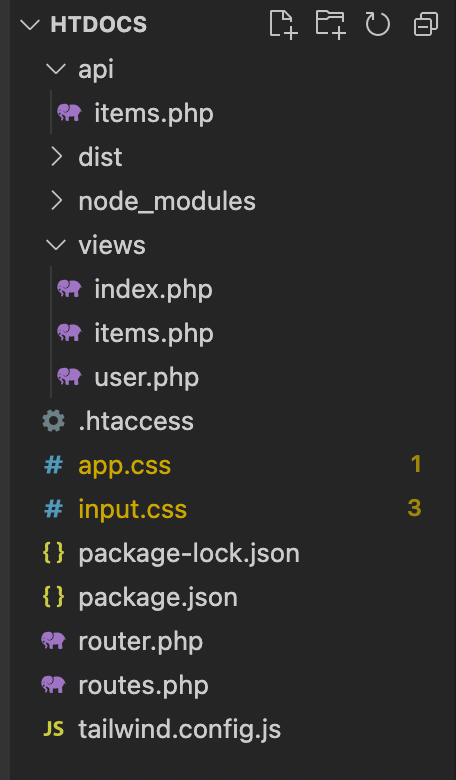

# Cheatsheet Web Dev PHP

## How to start a PHP file

To start a PHP file, first of all you name it and end it with .php.

Example filename.php

To start using PHP in the file you start the file with the following:

```
<?php
// Code here
?>
```

You don't need to close the PHP tag, unless you have HTML beneath it.

## Display Errors on Mac PHP

`ini_set('display_errors', 1);`

## Display content

`echo 'Hello'`

## Short and normal echo

If you want to display something, you usually start the PHP tag and then type echo 'xxx'.

But when you do inline PHP you can shorten it down, by typing the following:

```
<?= ?>
```

The `<?= ` is the same as `<?php echo ?> `

## Find directory

`__DIR__.'/filename.php';`

## http_response_code()

There are 3 http reponse codes that we check for the most

It's the following:

```
http_reponse_code(200);
http_response_code(300);
http_response_code(400);
```

So there is 200, 300 and 400.

**200** means that everything is okay.
**300** means an error from client side.
**400** means an error from server side.

## HTTP Methods

PHP technically only understands GET and POST. But the most known HTTP methods are the following:

```
GET     /users
GET     /users/$id
POST    /users
PUT     /users/$id
PATCH   /users/$id
DELETE  /users/$id
```

There is a difference between PUT and PATCH.

PUT updates the whole user, which means if you forget to type the `last_name`, when wanting to update the users first name, the users last name will be deleted completely.

But if you use PATCH, it will only update whatever you chose to update, and the rest of the users data will stay the same.

## PHP Associative Arrays

This is how to display an associative array in PHP:

```
$data = [
    'message' => 'Congrats',
    'id' => 1,
    'name' => 'Name',
    'last_name' => "Lastname",
    'year' => 2023,
    'price' => 10,
];
```

## exit();

We use `exit();` when we want the function to stop executing, when it's read through all the code between the start of the function to the `exit();`.

## json_encode vs json_decode

PHP is very friendly when it comes to a lot of things. But if you for example want to make an array into JSON you have to use `json_encode`.

It encodes an associtive array into a JSON object as seen below:

```
$data = [
    'message' => 'Congrats',
    'id' => 1,
    'name' => 'Name',
    'last_name' => "Lastname",
    'year' => 2023,
    'price' => 10,
];
echo json_encode($data);
```

The above code will turn the array into JSON, so it will look like this:

```
{
    'message': 'Congrats'
    'id': '1',
    'name': 'Name',
}
```

## $\_POST

We use $\_POST when something needs to be posted, like a form.

In this example we have created a form via. Thunder Client and created a field called "first_name".

```
$_POST['first_name'])
```

So in the above code, we take the "first_name" from our Thunder Client form.

## Forms and validation

It is important to validate all sort of forms, to make sure the data is correct and lives up to all the requirement that server asks of you.

For example when you create yourself as a new user, name has to be avalible, password has to contain x y and z characters, capital letters, one special character etc.

There are many ways to validate your forms and such. You can use RegEx or you can use inbuilt functions.

RegEx is easy to use, if you have an understanding of it or if it's a rather small validation.

If you want to validate something like an email, PHP has an inbuilt function, that validates emails, which contains the RegEx for email validation. If you had to type the RegEx email validation manually, it would be at least 50+ lines of code.

For email validation in PHP you can use the following example:

```
$myMail = $_POST['mail'];
if (! filter_var($myMail, FILTER_VALIDATE_EMAIL)) {
    http_response_code(400);
    echo json_encode(['error' => 'Enter a valid email']);
   }
```

What I've done in this example is that, I've set an varible called `$myMail` and made sure it matches to the mail I use in my Thunder Client field. You can also put it to something specific, so what you type in your Thunder Client matches with what you put your varible to.

It's the `filter_var($myMail, FILTER_VALIDATE_EMAIL)` that validates the email. It's a built in function from PHP.

The rest of the code just replies with a 400 error code, and tells the user in JSON that you have to enter a valid email.

## If/else statements

If you are familiar with JavaScript and it's if/else statements it works the same way.

Look at the example below.

```
if(strlen($_POST['last_name']) < 2){
        throw new Exception('last name min. 2 characters');
    }
```

In this example we check if the lenght of the last name is shorter than 2. If it is shorter than two, it sends an error message with the use of `throw new Exception`.

There is more information about this in the section about **"use of try catch"**

## Cocatenate

To cocatenate means to put strings together. To do so, you must make use of ' ', so you can put your variables together.

Example:

```
$name = 'A';
$last_name = 'B';
$full_name = 'Hi $name $last_name';
```

This will display:
`Hi A B`

Where as if you wrote it with " ", it will display the following:
`Hi $last_name`

The difference between ' ' and " ", is also the fact that with singular it does not check for variables in the text. Whereas when it's double it does check after every word if it's an varbiable or string etc.

## Difference between include & include_once

When there is something that you want to include, it's not something that is mandotory to include, it's the opposite - Optional.

This means that, if an ad for example doesn't show on the page and it's "include", it will still display the page, just not the ad.

When you use "include" it will include whatever you put it to include as many times you have told it to.

Example:

```
include __DIR__.'/filename.php';
include __DIR__.'/filename.php';
include __DIR__.'/filename.php';
```

This will display whatever is inside the filename.php, which is ` echo 'Hello'`.

So the actual display would be the following:

```
Hello
Hello
Hello
```

The reason for this, is that you've used "include" instead of "include_once".

If you used "include_once" like this:

```
include_once __DIR__.'/filename.php';
include_once __DIR__.'/filename.php';
include_once __DIR__.'/filename.php';
```

It would display the following:
`Hello`

## Difference between require & require_once

When there is something that you want to be required, it's something that is mandotory. It's something that HAS to be displayed, such as an login method.

It works the same way, as include and include_once, but if the user doesn't see the login option, the page will brick.

The following will require the page to display the 'Hello' from before:

```
require __DIR__.'/filename.php';
require __DIR__.'/filename.php';
require __DIR__.'/filename.php';
```

The following will require the page to display the 'Hello' from before ONCE:

```
require_once __DIR__.'/filename.php';
require_once __DIR__.'/filename.php';
require_once __DIR__.'/filename.php';
```

## Use of try catch

The try catch is used to either succeed or to catch errors.

It looks like this:

```
try{
    echo 'Nice';
}catch(Exception $e){
    echo 'Whoopsie';
}
```

If there is no errors it will display 'Nice'. If there is errors it will display 'Whoopsie'.

It is crtical that it contains the `(Exception $e)`.
The `$e` is the default way to type it. You can call it whatever you like.

Since there is no errors in the code before, if you wan't to reach the catch part, you can add the following code in try:
`throw new Exception();`

This will take you to the catch and it will display 'Whoopsie'.

The full code to reach catch is the following:

```
try{
    throw new Exception();
    echo 'Nice';
}catch(Exception $e){
    echo 'Whoopsie';
}
```

## Using try catch in Masterfile

So if you wanted to create a login page, you would have a file called api-login.php and a masterfile called \_.php (These names are up to you, this is what I'm gonna go with).

We start our api-login.php and \_.php file with

```
<?php
ini_set('display_errors', 1);
?>
```

This is just to be able to write PHP and for Mac users to see errors in Thunder Client.

We use the masterfile for code that is required and it makes it easier if you have to update something, such as validation, instead of having your validation multiple places. So if you have to make updates to your validation, you can do it in one place, but the validation is updated everywhere.

We start off with creating a function called

```
_validate_user_name(){
    //Validation here
}
```

This is our function for validation. But since this is the master file, we need to call the function in our api-login.php, so that file can call the functions inside of our master file.

We do this by writing the following:
`require_once __DIR__.'/_.php';`

We use require_once, because once we have it, that's it.

Now we are able to access whatever is in our masterfile by calling it. So if we wanted to use our `_validate_user_name()`, we just call it as below:

`_validate_user_name();`

## null coalescing operator

The null coalecing operator in PHP looks like this:

```
$varible === 'CONDITION' ? 'TRUE' : 'FALSE' ;
```

Which means you could type the following:

```
$title = 'Home';
echo $title === 'Home' ? 'yes' : '' ;
```

This would then display "yes", as the varible title is indeed equal to 'Home' (true). If you were to change the varible it would display nothing (false).

## Friendly URL in PHP

Friendly URL is very important. It makes it easier for Google to rank your website and therefore if you have an URL that looks like this: `127.0.0.1:8888/items/blue`, you will rank higher on Google.

But if your URL looks somethihng like this: ` 127.0.0.1:8888/items?color=blue` it will be very unfriendly and Google does not like this.

So lets say that we have the bad URL from before what we would do is, that we would go to our htaccess file and use "RewriteRule".

This is so we can rewrite the rule for this specific URL.

It would look like something like this:

```
RewriteRule ^items/(.*)$ /api/items.php?color=$1
```

What we do is, that we rewrite the rule for the URL. We say that anything that comes after `items/` is what should be afterwards.

So if you put `127.0.0.1:8888/items/blue ` that would work. Instead of having to do `127.0.0.1:8888/items?color=blue `

## PHP Router

We use a library for routing in PHP

All you do is follow the instructions on the GitHub repositories, and copypaste the code from said repository.

Website link: https://phprouter.com
GitHub link: https://github.com/phprouter/main

The code that we want to copy is from the routes.php, router.php and htaccess file.

## Routing in PHP

So to create proper routing in PHP, we use the links/code from the previous section.

What we do now is that, we comment out pretty much all of the code from the routes.php file, since we are not gonna use most of it (for now).

Which means the only code that you will not comment out is this:

```
<?php

require_once __DIR__.'/router.php';
```

Lets say that you file/folder structure looks sometihng like the below image. By default PHP would be looking for the `index.php` file in the root folder.



We got a lot of files, a few folders etc. But lets say that we want to access the `index.php`, which is inside the views folder.

For that we would have to use our `routes.php` and add a routing, so when you type `127.0.0.1:8888`, it's gonna take you directly to the `index.php`, as this is our frontpage.

So what we do in our `routes.php`, is that we type the following:

```
get('/', 'views/index');
```

What we do here is that we get our index file from our views folder.

In other words, we say that by default ( `127.0.0.1:8888` ), it should go to the folder views and take the file `index.php` and display that.
